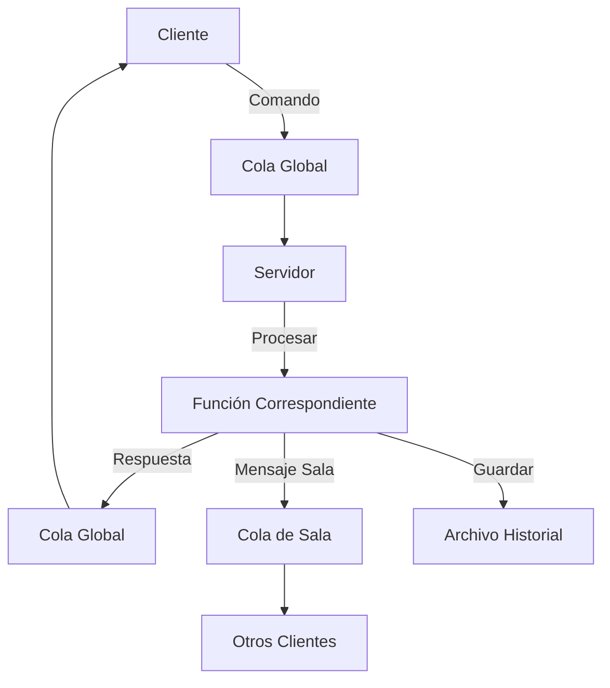

# 💬 Sistema de Chat con Colas de Mensajes

<div align="center">


**Un sistema de chat robusto y completo implementado en C con colas de mensajes System V**

[Características](#-características-principales) •
[Instalación](#️-instalación-y-compilación) •
[Uso](#-guía-de-uso) •
[Documentación](#-documentación-técnica) •
[Pruebas](#-pruebas-y-validación)

</div>

---

## 📋 Descripción del Proyecto

Este sistema de chat implementa comunicación en tiempo real entre múltiples usuarios utilizando **colas de mensajes System V** como mecanismo de IPC (Inter-Process Communication). El proyecto fue desarrollado como parte del curso de **Sistemas Operativos** y demuestra conceptos avanzados de programación de sistemas, incluyendo:

- 🔄 **Comunicación entre procesos** usando System V IPC
- 🏗️ **Arquitectura cliente-servidor** escalable
- 🧵 **Programación multihilo** con pthread
- � **Persistencia de datos** en archivos de texto
- 🛡️ **Manejo robusto de errores** y limpieza de recursos

## 🌟 Características Principales

### 🎯 **Funcionalidades Core**
- ✅ **Servidor central** que gestiona múltiples salas de chat
- ✅ **Soporte multiusuario** con conexiones simultáneas
- ✅ **Salas dinámicas** creadas automáticamente
- ✅ **Mensajería en tiempo real** entre usuarios de la misma sala
- ✅ **Interfaz de comandos** intuitiva y fácil de usar

### 🎨 **Comandos Disponibles**
| Comando | Descripción | Ejemplo |
|---------|-------------|---------|
| `/list` | Lista todas las salas disponibles con número de usuarios | `/list` |
| `/users` | Muestra usuarios en la sala actual | `/users` |
| `join <sala>` | Únete a una sala específica | `join General` |
| `/leave` | Sale de la sala actual | `/leave` |
| `<mensaje>` | Envía mensaje a la sala actual | `Hola a todos!` |
| `quit` | Sale del cliente | `quit` |

### 🚀 **Características Avanzadas**
- 📚 **Persistencia automática** de mensajes en archivos de texto
- 📖 **Historial inteligente** - carga últimos 10 mensajes al entrar a sala
- 🔔 **Notificaciones del sistema** para entrada/salida de usuarios
- 🧹 **Limpieza automática** de recursos y colas de mensajes
- 🔒 **Thread-safe** con sincronización mediante mutex
- ⚡ **Manejo de errores robusto** con recuperación automática

## 🖥️ Requisitos del Sistema

### **Requisitos Mínimos**
- 🐧 **Sistema Operativo**: Linux (Ubuntu 18.04+ recomendado)
- 🔧 **Compilador**: GCC 7.0+ con soporte C99
- 📚 **Bibliotecas**: pthread, System V IPC
- 💾 **Espacio en disco**: 10MB para compilación + historial
- 🔐 **Permisos**: Usuario con acceso a System V IPC

### **Dependencias**
```bash
# Ubuntu/Debian
sudo apt update
sudo apt install build-essential

# CentOS/RHEL/Fedora  
sudo yum groupinstall "Development Tools"
# o
sudo dnf groupinstall "Development Tools"
```

### **Verificar System V IPC**
```bash
# Verificar soporte para colas de mensajes
ipcs -l

# Debe mostrar algo como:
# ------ Messages Limits --------
# max queues system wide = 32000
# max size of message (bytes) = 8192
```

## 🛠️ Instalación y Compilación

### **Método 1: Usando Makefile (Recomendado)**
```bash
# Clonar el repositorio
git clone https://github.com/jotaPe-dv/p2SO.git
cd p2SO

# Compilar todo el sistema
make

# O paso a paso
make clean      # Limpiar archivos previos
make all        # Compilar servidor y cliente
```

### **Método 2: Compilación Manual**
```bash
# Compilar servidor
gcc -Wall -Wextra -std=c99 -o servidor servidor.c

# Compilar cliente  
gcc -Wall -Wextra -std=c99 -pthread -o cliente cliente.c
```

### **Verificar Compilación**
```bash
# Verificar que los ejecutables se crearon
ls -la servidor cliente

# Debería mostrar:
# -rwxr-xr-x 1 user user ##### fecha servidor
# -rwxr-xr-x 1 user user ##### fecha cliente
```

## 🎮 Guía de Uso

### **Paso 1: Iniciar el Servidor**
```bash
# Terminal 1
./servidor
```

**Salida esperada:**
```
Directorio de historial creado: historial
Servidor de chat iniciado. Cola global ID: 32768
Esperando clientes...
```

### **Paso 2: Conectar Clientes**
```bash
# Terminal 2
./cliente María

# Terminal 3  
./cliente Juan

# Terminal 4
./cliente Carlos
```

### **Paso 3: Interactuar en el Chat**

#### **Cliente María:**
```bash
$ ./cliente María
Bienvenido, María.
Comandos disponibles:
  /list        - Listar todas las salas disponibles
  /users       - Listar usuarios en la sala actual
  join <sala>  - Unirse a una sala
  /leave       - Salir de la sala actual
  <mensaje>    - Enviar mensaje a la sala actual
  quit         - Salir del cliente

> /list
No hay salas disponibles.

> join General
Te has unido a la sala: General
=== HISTORIAL RECIENTE DE LA SALA General ===
[2025-09-29 10:15:30] SISTEMA: *** Pedro se ha unido a la sala ***
[2025-09-29 10:15:45] Pedro: Buen día a todos!
=== FIN DEL HISTORIAL (últimos 2 mensajes) ===

> Hola, soy María!
Tú: Hola, soy María!

> /users
USUARIOS EN LA SALA 'General' (1 usuarios):
- María
```

#### **Cliente Juan:**
```bash
$ ./cliente Juan
> join General
Te has unido a la sala: General
*** María se ha unido a la sala ***

> Hola María, soy Juan
Tú: Hola María, soy Juan
María: Hola, soy María!

> /users
USUARIOS EN LA SALA 'General' (2 usuarios):
- María  
- Juan
```

#### **Cliente Carlos:**
```bash
$ ./cliente Carlos
> join Deportes
Te has unido a la sala: Deportes

> ¿Alguien vio el partido?
Tú: ¿Alguien vio el partido?

> /list
SALAS DISPONIBLES:
- General (2 usuarios)
- Deportes (1 usuarios)
```

## 📁 Estructura del Proyecto

```
📦 p2SO/
├── 📄 README.md                 # Documentación principal
├── 📄 TESTING.md               # Guía de pruebas
├── 📄 Makefile                 # Automatización de compilación
├── 🔧 servidor.c               # Código fuente del servidor
├── 🔧 cliente.c                # Código fuente del cliente
├── 🧪 test.sh                  # Script de pruebas completas
├── 🧪 test_simple.sh           # Script de pruebas básicas
├── 🧹 cleanup.sh               # Script de limpieza
├── 📊 logs_prueba/             # Directorio de logs (generado)
│   ├── servidor.log
│   ├── output_María.log
│   └── compilation.log
└── 💾 historial/               # Directorio de persistencia (generado)
    ├── sala_General.txt
    ├── sala_Deportes.txt
    └── sala_Música.txt
```

## � Sistema de Persistencia

### **Formato de Archivos de Historial**
Los mensajes se guardan automáticamente en archivos de texto con el formato:
```
[YYYY-MM-DD HH:MM:SS] Usuario: mensaje
```

### **Ejemplo: `historial/sala_General.txt`**
```
[2025-09-29 14:30:15] SISTEMA: *** María se ha unido a la sala ***
[2025-09-29 14:30:22] María: Hola a todos en General!
[2025-09-29 14:30:45] SISTEMA: *** Juan se ha unido a la sala ***
[2025-09-29 14:30:50] Juan: Hola María, ¿cómo estás?
[2025-09-29 14:31:10] María: Muy bien, gracias por preguntar
[2025-09-29 14:31:25] SISTEMA: *** Juan ha salido de la sala ***
[2025-09-29 14:31:40] María: Nos vemos Juan!
```

### **Características del Sistema de Persistencia**
- 📝 **Guardado automático** de todos los mensajes
- 📅 **Timestamps precisos** con fecha y hora
- 🔄 **Carga automática** de historial al crear salas
- 📊 **Límite inteligente** de 10 mensajes más recientes
- 🔔 **Notificaciones del sistema** incluidas en historial

## �️ Arquitectura Técnica

### **Servidor Central**
```
🎛️ Servidor
├── 📮 Cola Global (solicitudes de clientes)
├── 🏠 Gestión de Salas
│   ├── 📮 Cola por Sala (mensajes)
│   ├── 👥 Lista de Usuarios
│   └── 📝 Persistencia de Mensajes
├── 🔧 Funciones Core
│   ├── crear_sala()
│   ├── agregar_usuario_a_sala()
│   ├── enviar_a_todos_en_sala()
│   └── guardar_mensaje_en_archivo()
└── 🧹 Limpieza de Recursos
```

### **Cliente Multihilo**
```
👤 Cliente
├── 🧵 Hilo Principal
│   ├── 📝 Lectura de comandos
│   ├── 📤 Envío de mensajes  
│   └── 🎮 Interfaz de usuario
├── 🧵 Hilo Receptor
│   ├── 📥 Recepción de mensajes
│   ├── 🔔 Notificaciones
│   └── 🖥️ Mostrar en pantalla
└── 🔒 Sincronización (mutex)
```

### **Flujo de Comunicación**


## 🧪 Pruebas y Validación

### **Scripts de Pruebas Disponibles**

#### 🔬 **Pruebas Básicas** (Siempre funcionan)
```bash
make test-simple
# o
./test_simple.sh
```
- ✅ Verificación de compilación
- ✅ Análisis de funciones implementadas
- ✅ Validación de estructura del código

#### 🚀 **Pruebas Completas** (Requiere System V IPC)
```bash
make test-full
# o  
./test.sh
```
- ✅ Pruebas funcionales completas
- ✅ Simulación de múltiples usuarios
- ✅ Validación de persistencia
- ✅ Verificación de todos los comandos

#### 🧹 **Limpieza del Sistema**
```bash
make cleanup
# o
./cleanup.sh
```

### **Interpretación de Resultados**
```bash
# ✅ Resultado exitoso
[✓] Todas las pruebas pasaron
🎉 Sistema de chat validado exitosamente 🎉

# ❌ Si hay errores  
[✗] Error: Function not implemented
# Solución: System V IPC no disponible, usar pruebas básicas
```

## 🔧 Solución de Problemas

### **Problema: Colas de Mensajes No Disponibles**
```bash
Error: Function not implemented
```
**Solución:**
1. Usar `test_simple.sh` para validar código
2. Verificar: `cat /proc/sys/kernel/msgmni`
3. Si es 0, System V IPC está deshabilitado

### **Problema: Procesos Colgados**
```bash
# Limpiar todo
./cleanup.sh

# O manualmente:
pkill -f servidor
pkill -f cliente
ipcs -q | grep $(whoami) | awk '{print $2}' | xargs ipcrm -q
```

### **Problema: Compilación Fallida**
```bash
# Verificar dependencias
gcc --version
make --version

# Compilar con debug
make debug
```

## 📊 Métricas del Proyecto

### **Estadísticas de Código**
- 📄 **Archivos fuente**: 2 (servidor.c, cliente.c)
- 📏 **Líneas de código**: ~1000 líneas
- 🔧 **Funciones implementadas**: 30+
- 🎯 **Comandos disponibles**: 6
- 📝 **Scripts de prueba**: 3
- 📚 **Documentación**: Completa

### **Funcionalidades Implementadas**
- ✅ **Básicas**: 100% (Chat, salas, usuarios)
- ✅ **Avanzadas**: 100% (Persistencia, historial, comandos especiales)
- ✅ **Extras**: 100% (Pruebas automatizadas, limpieza, documentación)

## 👥 Información del Equipo

### **Desarrolladores**
- 👨‍💻 **jotaPe-dv** - Desarrollo principal y arquitectura
- 📚 **Curso**: Sistemas Operativos
- 🏫 **Institución**: [Tu Universidad/Institución]
- 📅 **Período**: Septiembre 2025

### **Tecnologías Utilizadas**
-  **C (C99)**
-  **Linux**
-  **POSIX Threads**
-  **System V IPC**

### **Licencia**
```
MIT License - Proyecto Académico
Desarrollado con fines educativos
Sistema Operativos 2025
```

---

<div align="center">

### 🎯 **¡Gracias por usar nuestro Sistema de Chat!** 

Si tienes preguntas o sugerencias, no dudes en crear un **issue** en el repositorio.

**[⭐ Dale una estrella](https://github.com/jotaPe-dv/p2SO)** si te gustó el proyecto

</div>